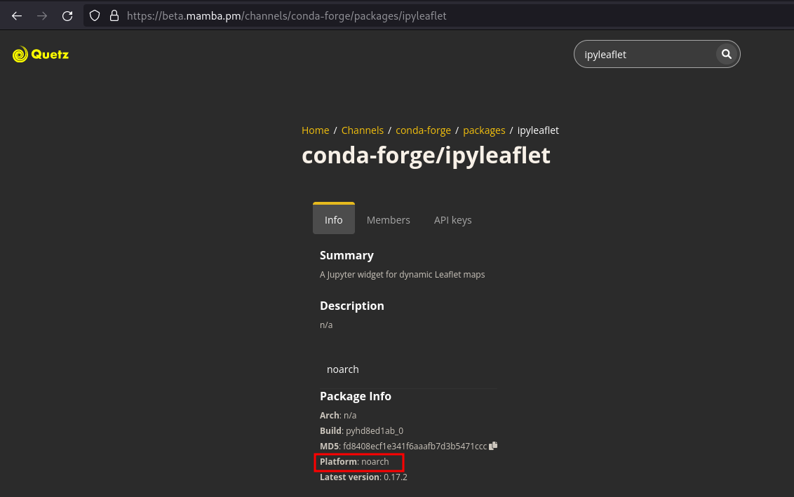

Shortlist packages to try:

```yml
name: xeus-python-kernel
channels:
  - https://repo.mamba.pm/emscripten-forge
  - conda-forge
dependencies:
    seaborn (0.12.0)
    scikit-learn (1.1.1)
    scipy (1.11.1)
    statsmodels (0.13.2)
    sympy (1.12)
    tabulate (1.5.0)
    xtensor (0.25.0)
    zarr (2.10.3)
    arrow-cpp (11.0.0)
    arrow-python (11.0.0)
    astropy (5.0.7)
    biopython (1.81)
    cryptography (3.3.2)
    cytoolz (0.12.2)
    lxml (4.9.3)
    matplotlib (3.5.2)
    numpy (1.25.2)
    pandas (1.5.3)
    pillow (10.1.0)
    pybind11 (2.10.4)
    pywavelets (1.4.1)
    qutip (4.7.3)
```

Only ``no-arch`` packages from ``conda-forge`` and packages from ``emscripten-forge`` can be installed.
- **How do I know if a package is ``no-arch`` on ``conda-forge``?** ``no-arch`` means that the package is OS-independent, usually pure-python packages are ``no-arch``. To check if your package is ``no-arch`` on ``conda-forge``, check if the "Platform" entry is "no-arch" in the https://beta.mamba.pm/channels/conda-forge?tab=packages page. If your package is not ``no-arch`` but is a pure Python package, then you should probably update the feedstock to turn your package into a ``no-arch`` one.

- **How do I know if my package is on ``emscripten-forge``?** You can see the list of packages pubished on ``emscripten-forge`` [here](https://beta.mamba.pm/channels/emscripten-forge?tab=packages). In case your package is missing, or it's not up-to-date, feel free to open an issue or a PR on https://github.com/emscripten-forge/recipes.
